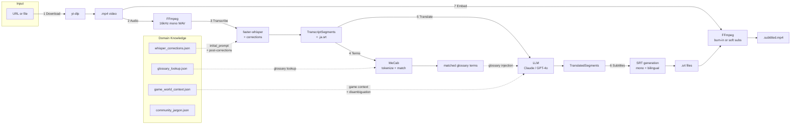
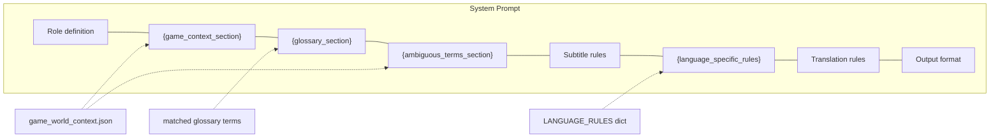
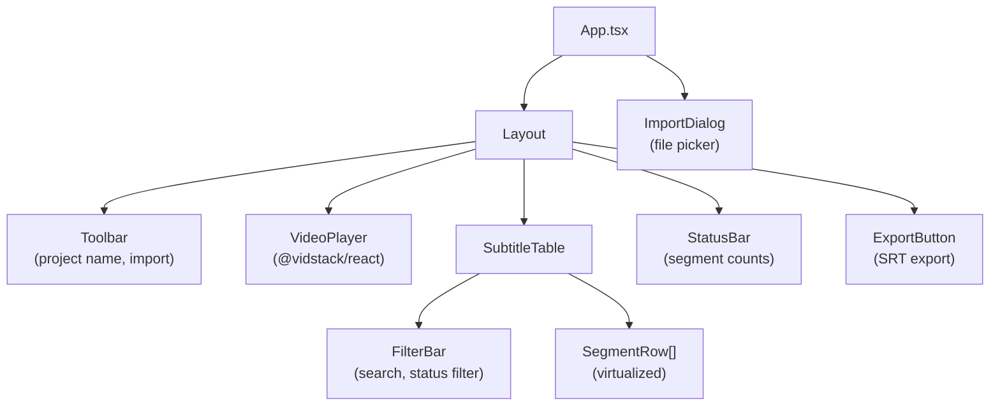

# Architecture

Yaki-Ika (やき・イカ) is an automated pipeline that downloads Splatoon 3 Japanese gameplay videos, transcribes the audio, translates subtitles to English/Chinese using LLMs with domain-specific glossary injection, and burns the result into the video. It combines faster-whisper ASR with Splatoon-specific correction dictionaries and a 1,700+ term glossary built from datamined game files and community jargon.

## System Diagram



## Pipeline Steps

The pipeline is orchestrated by `run_pipeline()` in `src/splatoon_translate/pipeline.py` and exposed as the `splatoon-translate` CLI command.

### Step 1: Download

| | |
|---|---|
| **File** | `src/splatoon_translate/download.py` |
| **Input** | YouTube URL or local file path |
| **Output** | `.mp4` video file |
| **Tool** | `yt-dlp` |

Downloads video at up to 1080p, merges to MP4. Skipped if input is a local file. Also provides `download_auto_subs()` for fetching YouTube's auto-generated subtitles (not used in the main pipeline).

### Step 2: Audio Extraction

| | |
|---|---|
| **File** | `src/splatoon_translate/audio.py` |
| **Input** | Video file (`.mp4`) |
| **Output** | 16kHz mono WAV |
| **Tool** | `ffmpeg` |

Extracts audio in the exact format faster-whisper expects: 16kHz sample rate, mono channel, 16-bit PCM.

### Step 3: Transcription

| | |
|---|---|
| **File** | `src/splatoon_translate/transcribe.py` |
| **Input** | WAV audio file |
| **Output** | `list[TranscriptSegment]` (start, end, text, words) |
| **Tool** | `faster-whisper` (default model: `large-v3-turbo`) |

Key behaviors:
- **VAD filter enabled** (`min_silence_duration_ms=500`) — prevents hallucination on BGM/silence
- **Beam size 1** — lowest hallucination rate per research
- **`initial_prompt`** — injects ~410 chars of Splatoon terminology to bias Whisper toward correct transcription of coined katakana terms
- **Post-transcription corrections** — applies 48 rules from `whisper_corrections.json` (see ASR Correction Pipeline below)
- **Hallucination filter** — drops segments with `no_speech_prob > 0.6`
- Saves JP transcript as `.ja.srt`

### Step 4: Term Extraction

| | |
|---|---|
| **File** | `src/splatoon_translate/terms.py` |
| **Input** | `list[TranscriptSegment]` + glossary lookup dict |
| **Output** | `list[dict]` of matched glossary entries |
| **Tool** | `MeCab` (morphological analyzer) |

Matches transcript text against the glossary using three strategies:
1. **Exact token match** — MeCab surface forms looked up directly in the glossary
2. **N-gram match** — 2-gram and 3-gram adjacent tokens joined and looked up
3. **Substring match** — glossary keys longer than 3 characters searched as substrings in the full transcript text

### Step 5: Translation

| | |
|---|---|
| **File** | `src/splatoon_translate/translate.py` |
| **Input** | `list[TranscriptSegment]` + matched glossary entries |
| **Output** | `list[TranslatedSegment]` (index, start, end, original, translated) |
| **Tool** | Anthropic API (Claude) or OpenAI API (GPT-4o) |

Translates segments in batches of 40 (configurable). Each batch sends one API call with:
- System prompt containing game context, glossary table, disambiguation rules, and language-specific subtitle rules
- User message with numbered JP segments

See Translation Prompt Architecture below for details.

### Step 6: Subtitle Generation

| | |
|---|---|
| **File** | `src/splatoon_translate/subtitle.py` |
| **Input** | `list[TranslatedSegment]` |
| **Output** | Two `.srt` files: translated-only and bilingual (JP + translated) |

Handles line wrapping per language config (`max_chars_per_line`: 42 for EN, 22 for CJK). Splits at nearest space for English; hard-wraps at character limit for CJK. Maximum 2 lines per subtitle.

### Step 7: Subtitle Embedding

| | |
|---|---|
| **File** | `src/splatoon_translate/embed.py` |
| **Input** | Video file + SRT file |
| **Output** | `.subtitled.mp4` |
| **Tool** | `ffmpeg` |

Two modes:
- **Burn-in** (default) — renders subtitles permanently into the video using the `subtitles` filter with ASS styling. Attempts GPU encoding (`h264_nvenc`), falls back to CPU (`libx264`) on failure. Uses a temp directory to avoid Windows path escaping issues with FFmpeg's subtitle filter.
- **Soft subs** — muxes SRT as a toggleable track without re-encoding (fast, `mov_text` codec).

## Data Architecture

All data files live under `data/` in the repo root: `glossary/`, `jargon/`, `corrections/`, `context/`, and `references/`.

### Glossary System

```
data/glossary/
├── glossary.json            # Base EN glossary (1,790 entries)
├── glossary.en.json         # EN glossary (1,901 entries)
├── glossary.zh-CN.json      # Simplified Chinese (1,834 entries)
├── glossary.zh-TW.json      # Traditional Chinese (1,772 entries)
├── glossary_lookup.json     # O(1) lookup dict keyed by JP term (base)
├── glossary_lookup.en.json
├── glossary_lookup.zh-CN.json
└── glossary_lookup.zh-TW.json
```

**Sources**: Built by `scripts/build_glossary.py` from:
1. **Leanny's datamined data** (`deps/splat3/data/language/JPja.json` + target language file) — aligned by shared keys across 18 priority categories (weapons, stages, gear, modes, etc.)
2. **Community jargon** (`data/jargon/`) — manually curated terms that override datamined entries on conflict

**Format**: Each entry is `{"jp": "スプラシューター", "target": "Splattershot", "category": "WeaponName_Main"}`. The lookup files are the same data keyed by JP term for O(1) matching.

**Build process**: `python scripts/build_glossary.py [lang]` → reads raw data → aligns JP↔target by category → merges jargon (jargon takes precedence) → writes `glossary.{lang}.json` + `glossary_lookup.{lang}.json`.

### Community Jargon

```
data/jargon/
├── community_jargon.json       # EN jargon (300 entries)
├── community_jargon.zh-CN.json # Simplified Chinese (241 entries)
└── community_jargon.zh-TW.json # Traditional Chinese (168 entries)
```

Manually curated terms not in Leanny's data: abbreviations (スシ→Splattershot), strategy terms (打開→retake), ability shorthands (イカ速→Swim Speed Up), Salmon Run vocabulary, callouts, slang, character names, commentary patterns, and known Whisper mistranscriptions. Each entry includes category and optional context/notes.

### Whisper Corrections

```
data/corrections/
└── whisper_corrections.json    # 48 correction rules + initial_prompt terms
```

Three sections:
- **`corrections`** (48 rules) — post-transcription find-and-replace rules with types: `compound_split` (20), `kanji_substitution` (13), `partial_kanji` (10), `training_artifact` (3), `kana_confusion` (1), `hiragana_variant` (1)
- **`initial_prompt_terms`** (13 strings, ~410 chars) — concatenated into Whisper's `initial_prompt` to bias the language model toward Splatoon terminology
- **`correction_config`** — feature flags for enabling/disabling correction categories

**Guard system**: 5 corrections are guarded (e.g., 寿司→スシ only applies in Splatoon context). Guarded corrections are skipped by default unless the `guarded_corrections_require_context` flag is set to `false`.

### Game World Context

```
data/context/
└── game_world_context.json
```

Structured knowledge about Splatoon 3 injected into the translation prompt: game overview, key concepts (inking, splatting, squid form), game modes, characters (Deep Cut, Squid Sisters, Off the Hook), translation tone guide, ambiguous term disambiguation, and weapon class JP↔EN divergences.

## Reference Translation System

A standalone subsystem for collecting and storing reference translations from any source, to compare against LLM-generated pipeline output.

### Purpose

The pipeline produces LLM translations but has no built-in way to evaluate quality. Community translations (fan-subs, soft subtitles, reviewed corrections) serve as ground truth for comparison. This system collects, indexes, and stores them.

### Sources

| Source | Method | Module |
|--------|--------|--------|
| Burned-in subtitles (e.g., Bilibili fan-subs) | PaddleOCR frame extraction | `ocr.py` |
| Soft subtitles (CC tracks) | yt-dlp subtitle download | `gather_references.py` |
| Reviewed pipeline output | Web UI export → SRT import | `references.py` |
| Local SRT files | Direct import | `references.py` |

### OCR Module (`ocr.py`)

Standalone module — never imported by the main pipeline. Requires the `[ocr]` optional dependency group.

**Algorithm:**
1. **Frame sampling** — OpenCV `VideoCapture`, sample every 0.5s, crop to bottom 25% (subtitle region)
2. **Frame dedup** — Pixel-difference threshold between consecutive crops; skip OCR if near-identical
3. **OCR** — PaddleOCR (`lang='ch'`), confidence threshold 0.75, multi-line concatenation
4. **Text dedup + timing** — Group consecutive frames with similar text (SequenceMatcher ≥ 0.85), record start/end timestamps
5. **Output** — SRT and/or JSON

### Reference Storage (`references.py`)

Per-collection JSON files stored in `data/references/<platform>/`, with a master index at `data/references/index.json`. Platform directories are created on demand.

Each collection contains metadata (source URL, platform, language, extractor) and a list of timed text segments. Factory methods create collections from OCR JSON or SRT files.

### CLI Tools

| Script | Purpose |
|--------|---------|
| `scripts/extract_subtitles.py` | OCR extraction from video file or URL → SRT/JSON |
| `scripts/gather_references.py` | Add/list/search reference translations; auto-detects platform from URL; tries soft-sub extraction before OCR fallback |

### Future (Phase 2)

- Timestamp-based JP↔reference alignment
- RAG injection of reference translations into LLM prompts
- Automated evaluation metrics (BLEU, semantic similarity)

## Domain Knowledge (RAG Approach)

The system uses retrieval-augmented generation (RAG) to inject domain knowledge into the translation LLM:

### How Glossary Matching Works

`terms.py:match_glossary()` finds which glossary terms appear in the transcript:

1. **Exact token match** — MeCab tokenizes each segment; each surface form is looked up in the glossary dict
2. **N-gram match** — adjacent tokens (2-gram, 3-gram) are joined and looked up, catching multi-token compound terms
3. **Substring match** — glossary keys >3 chars are searched as substrings in the full concatenated transcript, catching terms MeCab might split differently

Result: a deduplicated list of matched glossary entries.

### How Glossary Injection Works

`translate.py:_build_glossary_section()` formats matched terms into a markdown table injected into the system prompt:

```
GLOSSARY (MANDATORY — use these translations exactly):
| Japanese | English |
|----------|---------|
| スプラシューター | Splattershot |
| ガチエリア | Splat Zones |
...
```

The LLM is instructed to use glossary translations exactly as given.

### Ambiguous Term Handling

`game_world_context.json` contains a `translation_tone_guide.ambiguous_terms` section listing terms with context-dependent meanings (e.g., エリア usually means "Splat Zones" not generic "area"). This is formatted into a `DISAMBIGUATION` section in the system prompt.

## Translation Prompt Architecture

The system prompt (`translate.py:SYSTEM_PROMPT`) is assembled from dynamic sections:



**Batching**: Segments are sent in batches of 40 with globally consistent numbering. Each batch is one API call. The LLM returns `[N] translated text` lines, parsed back into `TranslatedSegment` objects. Missing segments fall back to original JP text with a stderr warning.

**Language-specific rules** vary by target:
- **EN**: contractions, active voice, community terms
- **zh-CN**: 口语化简体中文, community expressions, official translations
- **zh-TW**: 口語化繁體中文, community expressions, official translations

## ASR Correction Pipeline

Two-layer correction system applied during transcription:

### Layer 1: initial_prompt Guidance

13 concatenated strings (~410 chars) injected into Whisper's `initial_prompt` parameter. Contains Splatoon weapon names, special weapons, game modes, Salmon Run bosses, ability abbreviations, and strategy terms — all in their correct katakana forms. This biases Whisper's language model toward recognizing these terms correctly.

### Layer 2: Post-Transcription Corrections

Applied by `transcribe.py:_apply_corrections()` after each segment is transcribed:

| Type | Count | Example |
|------|-------|---------|
| `compound_split` | 20 | `スプラ シューター` → `スプラシューター` |
| `kanji_substitution` | 13 | `食安` → `ショクワンダー` |
| `partial_kanji` | 10 | `蟹タンク` → `カニタンク` |
| `training_artifact` | 3 | `ご視聴ありがとうございました` → removed |
| `kana_confusion` | 1 | `シクワンダー` → `ショクワンダー` |
| `hiragana_variant` | 1 | `ナイスだま` → `ナイスダマ` |

### Hallucination Filtering

- Segments with `no_speech_prob > 0.6` are dropped entirely
- Training artifact phrases (YouTube outros, subtitle credits) are removed or flagged

## Configuration

All defaults are set in `src/splatoon_translate/config.py` and can be overridden via environment variables or CLI arguments.

### Environment Variables

| Variable | Default | Description |
|----------|---------|-------------|
| `ASR_MODEL_SIZE` | `large-v3-turbo` | Whisper model size |
| `ASR_DEVICE` | `cuda` | Device for Whisper inference |
| `ASR_COMPUTE_TYPE` | `float16` | Compute precision |
| `ANTHROPIC_API_KEY` | (required) | Anthropic API key |
| `OPENAI_API_KEY` | (optional) | OpenAI API key |
| `TRANSLATION_MODEL` | `claude-sonnet-4-20250514` | LLM model name |
| `TRANSLATION_PROVIDER` | `anthropic` | `anthropic` or `openai` |
| `TARGET_LANGUAGE` | `zh-CN` | Target language code |

### Language Configs

| Code | Name | Leanny File | Max Chars/Line | Font |
|------|------|-------------|----------------|------|
| `en` | English | `USen.json` | 42 | Arial |
| `zh-CN` | Simplified Chinese | `CNzh.json` | 22 | Microsoft YaHei |
| `zh-TW` | Traditional Chinese | `TWzh.json` | 22 | Microsoft JhengHei |

### CLI Usage

```
splatoon-translate <source> [options]

Arguments:
  source                     YouTube URL or local video file path

Options:
  -o, --output-dir DIR       Output directory (default: ./output)
  -l, --lang {en,zh-CN,zh-TW}  Target language (default: zh-CN)
  --model-size SIZE          Whisper model size (default: large-v3-turbo)
  --translation-model MODEL  LLM model name
  --translation-provider {anthropic,openai}
  --no-burn                  Skip video burn-in (SRT only)
  --soft-subs                Add as toggleable subtitle track
  --cpu                      Use CPU for FFmpeg encoding
  --no-intermediates         Don't keep intermediate files
```

## Web Review UI

A browser-based tool for reviewing and editing pipeline output before final export.

### Stack

| Layer | Technology |
|-------|-----------|
| Build | Vite 7 |
| Framework | React 19 + TypeScript 5.9 |
| Styling | Tailwind CSS v4 + shadcn/ui (new-york) |
| Video | @vidstack/react 1.12 |
| State | Zustand 5 (3 stores) |
| Virtualization | @tanstack/react-virtual |
| SRT parsing | subsrt-ts |

### State Stores

| Store | File | Purpose |
|-------|------|---------|
| `useProjectStore` | `web/src/stores/project-store.ts` | Segments, terms, video URL, project name, load/edit/reset |
| `usePlaybackStore` | `web/src/stores/playback-store.ts` | Current time, duration, playing state, seek targets |
| `useUiStore` | `web/src/stores/ui-store.ts` | Selected segment, status filter, search query, editing state |

### Data Flow

1. **Import**: User loads video + JP SRT + translated SRT (+ optional terms JSON) via import dialog
2. **Pairing**: `pairSubtitles()` aligns JP and translated segments by index
3. **Review**: Video player syncs with subtitle table; clicking a row seeks video; active segment highlights during playback
4. **Edit**: Inline editing of translations; per-segment status tracking (pending/approved/needs-revision/rejected)
5. **Filter**: Search by text, filter by status
6. **Export**: SRT export of edited translations via `subsrt-ts`

### Component Structure



## Key Design Decisions

| Decision | Alternatives Considered | Rationale |
|----------|------------------------|-----------|
| faster-whisper over openai/whisper | openai/whisper, kotoba-whisper | 4-8x faster, CTranslate2 optimization, same accuracy, built-in VAD filter |
| Beam size 1 | 3, 5 | Research showed lowest hallucination rate on JP audio with BGM |
| LLM translation over fine-tuned NMT | DeepL, Google Translate, fine-tuned MarianMT | Only LLMs can enforce glossary terms via prompt; handle context-dependent disambiguation; maintain speaker tone |
| RAG glossary injection over fine-tuning | Fine-tuned translation model | Glossary changes don't require retraining; easy to add/fix terms; transparent which terms are enforced |
| MeCab tokenization for term matching | Regex, SudachiPy | MeCab has fastest startup, lightest memory footprint, sufficient accuracy for glossary lookup |
| SRT format over ASS | ASS, VTT, TTML | SRT is universally supported; ASS styling is applied at FFmpeg burn time via `force_style` |
| Batch size 40 for translation | 20, 80, full-transcript | Balances API cost (fewer calls) vs. accuracy (LLM loses coherence on very long inputs) |
| Zustand over Redux | Redux, Jotai, Context API | Minimal boilerplate, built-in TypeScript support, no provider wrapping needed |
| @vidstack/react over video.js | video.js, react-player, plyr | Native React, modern API, good TypeScript support, React 19 compatible (v1.12+) |

## File Map

### Python Pipeline (`src/splatoon_translate/`)

| File | Description |
|------|-------------|
| `__init__.py` | Package marker |
| `pipeline.py` | 7-step orchestrator + CLI entry point (`main()`) |
| `config.py` | Centralized config: paths, model defaults, env vars, language configs |
| `download.py` | Video download via `yt-dlp` |
| `audio.py` | Audio extraction to 16kHz mono WAV via `ffmpeg` |
| `transcribe.py` | Whisper transcription with initial_prompt + post-corrections |
| `glossary.py` | Glossary build from Leanny's data + jargon; glossary loading |
| `terms.py` | MeCab tokenization + 3-strategy glossary matching |
| `translate.py` | LLM translation with prompt construction + batched API calls |
| `subtitle.py` | SRT generation with line wrapping (mono + bilingual) |
| `embed.py` | FFmpeg subtitle burn-in (GPU/CPU) and soft subtitle muxing |
| `ocr.py` | Burned-in subtitle OCR extraction using PaddleOCR (standalone, requires `[ocr]` extras) |
| `references.py` | Reference translation storage — save/load/list/search collections |

### Scripts

| File | Description |
|------|-------------|
| `scripts/build_glossary.py` | Standalone glossary builder (runs `glossary.build_glossary()`) |
| `scripts/extract_subtitles.py` | OCR subtitle extraction CLI (video file or URL → SRT/JSON) |
| `scripts/gather_references.py` | Reference translation management CLI (add/list/search) |

### Data Files (`data/`)

| File | Description |
|------|-------------|
| `glossary/glossary.{lang}.json` | Full glossary per target language |
| `glossary/glossary_lookup.{lang}.json` | O(1) lookup dict keyed by JP term |
| `jargon/community_jargon.json` | EN community jargon (300 entries) |
| `jargon/community_jargon.zh-CN.json` | Simplified Chinese jargon (241 entries) |
| `jargon/community_jargon.zh-TW.json` | Traditional Chinese jargon (168 entries) |
| `corrections/whisper_corrections.json` | ASR correction rules (48) + initial_prompt terms (13) |
| `context/game_world_context.json` | Game world knowledge for prompt injection |
| `references/index.json` | Master index of reference translation collections |
| `references/<platform>/*.json` | Per-collection reference translations (created on demand) |

### Web UI (`web/src/`)

| File | Description |
|------|-------------|
| `main.tsx` | React app entry point |
| `App.tsx` | Root component |
| `types/index.ts` | Shared types: `Segment`, `GlossaryTerm`, `SegmentStatus` |
| `stores/project-store.ts` | Project data store (segments, terms, video) |
| `stores/playback-store.ts` | Video playback state store |
| `stores/ui-store.ts` | UI state store (selection, filters, search) |
| `lib/srt.ts` | SRT parsing and subtitle pairing |
| `lib/file-loader.ts` | File reading, terms parsing, video URL management |
| `lib/utils.ts` | Utility functions (cn, etc.) |
| `hooks/use-active-segment.ts` | Hook: determines active segment from playback time |
| `hooks/use-filtered-segments.ts` | Hook: applies search + status filters to segments |
| `components/layout.tsx` | Main layout (video + table split) |
| `components/video-player.tsx` | Video player wrapper (@vidstack/react) |
| `components/subtitle-table/subtitle-table.tsx` | Virtualized subtitle table |
| `components/subtitle-table/segment-row.tsx` | Individual segment row (display + inline edit) |
| `components/subtitle-table/filter-bar.tsx` | Search and status filter controls |
| `components/import-dialog.tsx` | File import dialog |
| `components/export-button.tsx` | SRT export button |
| `components/toolbar.tsx` | Top toolbar |
| `components/status-bar.tsx` | Bottom status bar with segment counts |
| `components/ui/*.tsx` | shadcn/ui primitives (button, dialog, input, etc.) |

### Config Files

| File | Description |
|------|-------------|
| `pyproject.toml` | Python package config, dependencies, CLI entry point |
| `.env.example` | Required env vars template |
| `web/package.json` | Web UI dependencies |
| `web/vite.config.ts` | Vite build config |
| `web/tsconfig.json` | TypeScript config |
| `web/components.json` | shadcn/ui config (new-york style) |
| `web/.npmrc` | npm config (`legacy-peer-deps=true` for React 19 compat) |

## Dependencies

### External Tools (must be on PATH)

| Tool | Purpose |
|------|---------|
| `yt-dlp` | Video downloading |
| `ffmpeg` | Audio extraction, subtitle burn-in, video encoding |

### Python Packages

| Package | Purpose |
|---------|---------|
| `faster-whisper` >=1.1.0 | Whisper ASR via CTranslate2 |
| `mecab-python3` | Japanese morphological analysis |
| `unidic-lite` | MeCab dictionary |
| `anthropic` >=0.40 | Claude API client |
| `openai` >=1.50 | OpenAI API client |
| `python-dotenv` | `.env` file loading |
| `tqdm` | Progress bars |

**Optional `[ocr]` extras** (`uv sync --extra ocr`):

| Package | Purpose |
|---------|---------|
| `paddlepaddle-gpu` >=2.6 | PaddlePaddle deep learning framework (GPU) |
| `paddleocr` >=2.9 | OCR engine with CJK models |
| `opencv-python` >=4.8 | Video frame extraction and image processing |

### Data Sources

| Source | What | Used For |
|--------|------|----------|
| [Leanny/splat3](https://github.com/Leanny/splat3) | Datamined `JPja.json`, `USen.json`, `CNzh.json`, `TWzh.json` | Building the glossary (18 categories: weapons, stages, gear, modes, etc.) |
| Community research | Manually curated jargon JSONs | Strategy terms, abbreviations, slang, character names |

## Workspace Layout

This repo lives inside a multi-repo workspace:

```
splatoon-video-translate/          # workspace root
├── workspace.yaml                 # manifest: repos, deps, descriptions
├── CLAUDE.md                      # workspace-level instructions
├── docs/                          # research docs (historical, not maintained)
│   ├── 01-project-overview.md
│   ├── 02-japanese-asr-research.md
│   ├── 03-splatoon3-terminology.md
│   ├── 04-llm-translation-strategy.md
│   ├── 05-subtitle-pipeline.md
│   └── 06-splatoon3-game-world-knowledge.md
├── repositories/
│   └── splatoon-translate/        # THIS REPO (GitHub: Sandman-Ren/yaki-ika)
├── deps/                          # read-only reference repos
│   ├── splat3/                    # Leanny's datamined Splatoon 3 data
│   ├── faster-whisper/            # CTranslate2-based Whisper
│   ├── whisperX/                  # Whisper + word-level alignment
│   ├── faster-auto-subtitle/     # Reference pipeline architecture
│   └── N46Whisper/               # JP-specific subtitle generator
└── sketch/                        # scratch space (gitignored)
```

The workspace-level `docs/01-06` are research notes and design explorations created during initial development. This `ARCHITECTURE.md` is the maintained reference for the current implementation.
